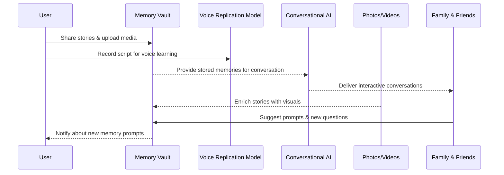

# CoreMemories — AI-Powered Living Legacy Platform

---

## Overview
CoreMemories is a next-generation **legacy-preservation platform** that transforms personal stories into **living conversations**. Using Conversational Memory AI and a secure Memory Vault, individuals can preserve their **voice, wisdom, and presence**, ensuring loved ones stay connected across generations.

---

## Problem Statement
Families and individuals faced limitations when preserving legacies:
1. Memories reduced to static photos or text without authentic voices.
2. No way for future generations to ask questions or receive advice.
3. Lack of a secure, unified system to preserve and enrich stories over time.

The challenge was to design a platform that creates **interactive, secure, and emotionally meaningful legacies**.

---

## Solution
Kcube AI developed **CoreMemories**, a platform blending **AI voice replication**, **conversational intelligence**, and **multimedia enrichment** into one seamless system.

### Key Features
- **Conversational Memory AI** — interactive conversations with loved ones’ authentic voices.  
- **Memory Vault** — private, encrypted repository for memories, recordings, and media.  
- **AI Voice Replication** — captures unique tone, personality, and laughter.  
- **Family Collaboration** — relatives can co-build legacies with prompts & shared memories.  
- **Multimedia Enrichment** — add photos, videos, and social content.  
- **Flexible Plans** — individual, family, and extended family tiers.  

---

## Tech Stack
| Technology                       | Purpose                              |
| -------------------------------- | ------------------------------------ |
| **FastAPI**                      | Scalable backend and API services    |
| **React**                        | Modern, responsive user interface    |
| **PostgreSQL**                   | Secure structured data storage       |
| **OpenAI**                       | Conversational AI & Embedding Models |
| **Voice AI Models (ElevenLabs)** | Custom voice training & replication  |
| **Azure Cloud**                  | Enterprise-grade hosting & security  |

---

## User Flow Diagram

---

## Live Link
[🌐 Core Memories AI](https://corememories.ai/)

---

**Developed by [Kcube AI](https://kcube.ai)**  
*AI Engineered for Excellence*
